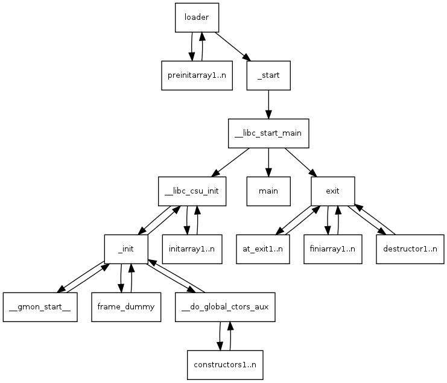

# SECTIONS DESCRIPTION
There are some sections listed by 'readelf' whose importance may vary from person to person. So, I'll start with the sections which I feel are more important from software development, binary analysis and malware research domains. 


## FOR PROGRAMMERS (Userland Software Developers)

### .TEXT SECTION
This section stores bytes which correspond to executable instructions (i.e. the programmer's code plus the C Runtime support) of the program, this section goes into the `code` segment (having Read-Execute permissions) when the binary gets loaded into memory. The section header entry corresponding to the .text section is shown bellow. This section is the most interesting part to Reverse Engineers as it gives idea about the overall design of a software program.

```shell
Section Headers:
  [Nr] Name   Type      Address           Off        Size               ES              Flg Lk    Inf   Al
...
  [13] .text  PROGBITS  00000000000004f0  000004f0   00000000000001b2  0000000000000000  AX 0     0     16
...
```
This clearly shows that memory is allocated for this section at runtime i.e. the section gets loaded into the memory (indicated by `A` flag) and is *executable* section (identified by the `X` flag). 

Lets see the content of this section. In the raw form, this just contains opcode/operand bytes which won't make sense to a human eye until we have an `assembly instruction set opcode table` or some tool (a disassembler) to interpret these bytes into CPU instructions. The GNU binutils have a program called `objdump` which can be used to display some information from an ELF binary. This utility has a disassembler which we'll use to disassemble raw bytes of .text section (present in [sd] program (compiled from the source [sd.c]) into x86_64 Intel CPU instructions. Generate the disassembly by - `objdump -d sd`, you'll see various `symbols` (explained later) with their disassembly, scroll down and look for \<main>  symbol, this is the main() described in the file [sd.c] and look at the source code [sd.c] and then the instructions constituting \<main> carefully.

```shell
critical@d3ad:~/BINARY_DISECTION_COURSE/ELF/SECTION_HEADER_TABLE/SECTION_DESCRIPTION$ objdump -M intel -d sd | grep -A14 "main>:"
00000000000005fa <main>:
 5fa:	55                   	push   rbp
 5fb:	48 89 e5             	mov    rbp,rsp
 5fe:	48 c7 c0 04 00 00 00 	mov    rax,0x4
 605:	48 c7 c7 05 00 00 00 	mov    rdi,0x5
 60c:	48 c7 c6 06 00 00 00 	mov    rsi,0x6
 613:	48 c7 c2 07 00 00 00 	mov    rdx,0x7
 61a:	b8 00 00 00 00       	mov    eax,0x0
 61f:	5d                   	pop    rbp
 620:	c3                   	ret    
 621:	66 2e 0f 1f 84 00 00 	nop    WORD PTR cs:[rax+rax*1+0x0]
 628:	00 00 00 
 62b:	0f 1f 44 00 00       	nop    DWORD PTR [rax+rax*1+0x0]

0000000000000630 <__libc_csu_init>:
```
You'll notice that the statements at 5fe, 605, 60c, 613 are the same instructions which we wrote in our source file [sd.c]. I hope this gives a brief idea and understanding towards the .text section.

**NOTE**: The `-M intel` flag is used with objdump to show the disassembly in **intel syntax** (unlike the default AT&T dialect) which is easier to begin with.
 
### .RODATA SECTION
This section stores all the string literals defined in the program. Look at the source [sd.c], the string used in the printf() is a string literal. To analyse any section for strings we use `-p` option with '**readelf**' which dumps the output content as strings.

```shell
critical@d3ad:~/BINARY_DISECTION_COURSE/ELF/SECTION_HEADER_TABLE/SECTIONS_DESCRIPTION$ readelf -p .rodata sd

String dump of section '.rodata':
  [     4]  Hello, critical ^_^
```


### .DATA SECTION
This section holds the initialized data of the program. You will find the initialized global/static variables inside this section. Let's look for .data section is file [sd] via objdump.

```shell
critical@d3ad:~/BINARY_DISECTION_COURSE/ELF/SECTION_HEADER_TABLE/SECTIONS_DESCRIPTION$ objdump -M intel -D sd | grep -A20 " .data"
Disassembly of section .data:

0000000000201000 <__data_start>:
	...

0000000000201008 <__dso_handle>:
  201008:	08 10                	or     BYTE PTR [rax],dl
  20100a:	20 00                	and    BYTE PTR [rax],al
  20100c:	00 00                	add    BYTE PTR [rax],al
	...

0000000000201010 <global_var>:
  201010:	08 00                	or     BYTE PTR [rax],al
	...

Disassembly of section .bss:

0000000000201014 <__bss_start>:
  201014:	00 00                	add    BYTE PTR [rax],al
	...

```
Look at the address of the symbol `0000000000201010 <global_var>`, it is the name of the global variable which have the value '8' defined in the source file [sd.c]. Objdump shows the disassembly `or BYTE PTR [rax],dl` here since it is confused between code and data. Objdump does not differ between the code and data, it disassembles everthing that it is asked to do. This could result into a disaster if it was the CPU interpreting these data bytes (see [stack buffer overflow]). Thus, sections and segments play a very important role in eliminating this confusion as they help the processor to understand the organisation of code and data.


### .BSS SECTION
BSS here stands for **B**lock **S**tarted by **S**ymbol. This section stores the uninitialized data of the program. Any variable in this section is cleared with 0. In SHT, this section header entry is marked as sh_type SH_NOBITS as .bss section does not occupy any space on disk (to avoid wastage of disk space as the memory for this section is going to get cleared anyways)


## FOR MALWARE RESEARCHERS (and probably other low-level domains)

### .SHSTRTAB 
This is a string table for SHT which stores **section names** (in the form of NULL terminated strings). It is used by compile-time linker and tools like readelf to identify sections. Use the following options with readelf -
* `-x` : To dump content of section in hexadecimal format.
* `-p` : To dump content of section in the form of strings.<br>
 
Usage : `readelf -p <section_name|section_index> <elf_binary>`<br>
Let's look at the `.shstrtab` section of the binary [sd].

```shell
critical@d3ad:~/BINARY_DISECTION_COURSE/ELF/SECTION_HEADER_TABLE/SECTIONS_DESCRIPTION$ readelf -p .shstrtab sd

String dump of section '.shstrtab':
  [     1]  .symtab
  [     9]  .strtab
  [    11]  .shstrtab
  [    1b]  .interp
  [    23]  .note.ABI-tag
  [    31]  .note.gnu.build-id
  [    44]  .gnu.hash
  [    4e]  .dynsym
  [    56]  .dynstr
  [    5e]  .gnu.version
  [    6b]  .gnu.version_r
  [    7a]  .rela.dyn
  [    84]  .rela.plt
  [    8e]  .init
  [    94]  .plt.got
  [    9d]  .text
  [    a3]  .fini
  [    a9]  .rodata
  [    b1]  .eh_frame_hdr
  [    bf]  .eh_frame
  [    c9]  .init_array
  [    d5]  .fini_array
  [    e1]  .dynamic
  [    ea]  .data
  [    f0]  .bss
  [    f5]  .comment
```

### .SYMTAB AND .DYNSYM 
In high level programming languages like C/C++, the programmer uses function names that are used as **symbolic name** to represent a particular location (in file or memory). Similarly, all global/static/external variable names are also symbolic representations to some location. Together, we have what we call **function** and **data symbols**, i.e. symbols that represent *routines* and *variables* respectively.<br> 
There are 3 stages at which symbol resolution occurs - 
* **Compile-time fixup**: relocatable binaries (object files) have both function and data symbols which are resolved by the compile-time linker ld (the one which stiches up one or more object files into final executable binary). After this fixup, the final executable contains an address marking those symbol locations.
* **runtime fixup**: there are certain symbolic names which are external to the binary we are executing and whose location cannot be known until the runtime. One such example is the symbol resolution of **printf()** which is not defined inside our binary and rather inside *libc.so* (which is the Standard C library - remember one of the type of binaries on Linux is the shared object). To replace the call to printf() with an address, we need to know at what base address is *libc.so* loaded into memory which cannot be determined until the program execution (runtime). Therefore, dynamic symbols are resolved at runtime by the dynamic linker (ld-linux.so).
* **lazy binding**: A shared library being used by any program contains many functions whose addresses needs to be resolved by the dynamic linker before they can be used. To save a significant amount of load and linking time, external function symbol resolution (like printf() from libc.so) is postponed to the first time that function is called by the program. This This is known as lazy binding or **delay loading** or **lazy loading** (term varies from one platfrom to the other). Ask yourself, why would someone care to fixup a library function address which is never getting called by the program ? This indeed saves a significant amount of program startup time! We'll discuss its mechanism probably later in the course.


**NOTE**: Don't confuse ld (compile-time linker a.k.a static linker) with ld.so (dynamic linker). The **compile-time linker (ld)** is a part of the **compiler toolchain** and is responsible for generating the final executable binary from source code while **dynamic linker** (`ld-linux.so` or simply `ld.so`) links the binary program with shared libraries (at runtime, i.e. in memory). The dynamic linker also goes by the name of **runtime linker** and **program interpreter**. I personally have been mindfucked for months while understanding machine level concepts remaining confused in linkers and loaders (it was when I felt lack of beginner friendly resources).

The section **\.symtab** contains the static symbols used in the compile-time linker whereas the section **\.dynsym** contains the Runtime/Dynamic symbols used throughout the program. Static symbols are removed if the binary is stripped since they are resolved and wouldn't contribute to execution of a program. The symbols exported by shared libraries (DLL's or SO's) are also stored in .dynsym section. Let's look at the symbols with `-s` options in readelf which displays the symbol tables (both static and dynamic).

```shell
critical@d3ad:~/BINARY_DISECTION_COURSE/ELF/SECTION_HEADER_TABLE/SECTIONS_DESCRIPTION$ readelf -s sd

Symbol table '.dynsym' contains 7 entries:
   Num:    Value          Size Type    Bind   Vis      Ndx Name
     0: 0000000000000000     0 NOTYPE  LOCAL  DEFAULT  UND 
     1: 0000000000000000     0 NOTYPE  WEAK   DEFAULT  UND _ITM_deregisterTMCloneTab
     2: 0000000000000000     0 FUNC    GLOBAL DEFAULT  UND puts@GLIBC_2.2.5 (2)
     3: 0000000000000000     0 FUNC    GLOBAL DEFAULT  UND __libc_start_main@GLIBC_2.2.5 (2)
     4: 0000000000000000     0 NOTYPE  WEAK   DEFAULT  UND __gmon_start__
     5: 0000000000000000     0 NOTYPE  WEAK   DEFAULT  UND _ITM_registerTMCloneTable
     6: 0000000000000000     0 FUNC    WEAK   DEFAULT  UND __cxa_finalize@GLIBC_2.2.5 (2)

Symbol table '.symtab' contains 65 entries:
   Num:    Value          Size Type    Bind   Vis      Ndx Name
     0: 0000000000000000     0 NOTYPE  LOCAL  DEFAULT  UND 
     1: 0000000000000238     0 SECTION LOCAL  DEFAULT    1 
     2: 0000000000000254     0 SECTION LOCAL  DEFAULT    2 
     3: 0000000000000274     0 SECTION LOCAL  DEFAULT    3 
     4: 0000000000000298     0 SECTION LOCAL  DEFAULT    4 
     5: 00000000000002b8     0 SECTION LOCAL  DEFAULT    5 
     6: 0000000000000360     0 SECTION LOCAL  DEFAULT    6 
     7: 00000000000003e2     0 SECTION LOCAL  DEFAULT    7 
     8: 00000000000003f0     0 SECTION LOCAL  DEFAULT    8 
     9: 0000000000000410     0 SECTION LOCAL  DEFAULT    9 
    10: 00000000000004d0     0 SECTION LOCAL  DEFAULT   10 
    11: 00000000000004e8     0 SECTION LOCAL  DEFAULT   11 
    12: 0000000000000500     0 SECTION LOCAL  DEFAULT   12 
    13: 0000000000000520     0 SECTION LOCAL  DEFAULT   13 
    14: 0000000000000530     0 SECTION LOCAL  DEFAULT   14 
    15: 00000000000006e4     0 SECTION LOCAL  DEFAULT   15 
    16: 00000000000006f0     0 SECTION LOCAL  DEFAULT   16 
    17: 0000000000000708     0 SECTION LOCAL  DEFAULT   17 
    18: 0000000000000748     0 SECTION LOCAL  DEFAULT   18 
    19: 0000000000200db8     0 SECTION LOCAL  DEFAULT   19 
    20: 0000000000200dc0     0 SECTION LOCAL  DEFAULT   20 
    21: 0000000000200dc8     0 SECTION LOCAL  DEFAULT   21 
    22: 0000000000200fb8     0 SECTION LOCAL  DEFAULT   22 
    23: 0000000000201000     0 SECTION LOCAL  DEFAULT   23 
    24: 0000000000201014     0 SECTION LOCAL  DEFAULT   24 
    25: 0000000000000000     0 SECTION LOCAL  DEFAULT   25 
    26: 0000000000000000     0 FILE    LOCAL  DEFAULT  ABS crtstuff.c
    27: 0000000000000560     0 FUNC    LOCAL  DEFAULT   14 deregister_tm_clones
    28: 00000000000005a0     0 FUNC    LOCAL  DEFAULT   14 register_tm_clones
    29: 00000000000005f0     0 FUNC    LOCAL  DEFAULT   14 __do_global_dtors_aux
    30: 0000000000201014     1 OBJECT  LOCAL  DEFAULT   24 completed.7696
    31: 0000000000200dc0     0 OBJECT  LOCAL  DEFAULT   20 __do_global_dtors_aux_fin
    32: 0000000000000630     0 FUNC    LOCAL  DEFAULT   14 frame_dummy
    33: 0000000000200db8     0 OBJECT  LOCAL  DEFAULT   19 __frame_dummy_init_array_
    34: 0000000000000000     0 FILE    LOCAL  DEFAULT  ABS sd.c
    35: 0000000000000000     0 FILE    LOCAL  DEFAULT  ABS crtstuff.c
    36: 000000000000084c     0 OBJECT  LOCAL  DEFAULT   18 __FRAME_END__
    37: 0000000000000000     0 FILE    LOCAL  DEFAULT  ABS 
    38: 0000000000200dc0     0 NOTYPE  LOCAL  DEFAULT   19 __init_array_end
    39: 0000000000200dc8     0 OBJECT  LOCAL  DEFAULT   21 _DYNAMIC
    40: 0000000000200db8     0 NOTYPE  LOCAL  DEFAULT   19 __init_array_start
    41: 0000000000000708     0 NOTYPE  LOCAL  DEFAULT   17 __GNU_EH_FRAME_HDR
    42: 0000000000200fb8     0 OBJECT  LOCAL  DEFAULT   22 _GLOBAL_OFFSET_TABLE_
    43: 00000000000006e0     2 FUNC    GLOBAL DEFAULT   14 __libc_csu_fini
    44: 0000000000000000     0 NOTYPE  WEAK   DEFAULT  UND _ITM_deregisterTMCloneTab
    45: 0000000000201000     0 NOTYPE  WEAK   DEFAULT   23 data_start
    46: 0000000000000000     0 FUNC    GLOBAL DEFAULT  UND puts@@GLIBC_2.2.5
    47: 0000000000201014     0 NOTYPE  GLOBAL DEFAULT   23 _edata
    48: 00000000000006e4     0 FUNC    GLOBAL DEFAULT   15 _fini
    49: 0000000000201010     4 OBJECT  GLOBAL DEFAULT   23 global_var
    50: 0000000000000000     0 FUNC    GLOBAL DEFAULT  UND __libc_start_main@@GLIBC_
    51: 0000000000201000     0 NOTYPE  GLOBAL DEFAULT   23 __data_start
    52: 0000000000000000     0 NOTYPE  WEAK   DEFAULT  UND __gmon_start__
    53: 0000000000201008     0 OBJECT  GLOBAL HIDDEN    23 __dso_handle
    54: 00000000000006f0     4 OBJECT  GLOBAL DEFAULT   16 _IO_stdin_used
    55: 0000000000000670   101 FUNC    GLOBAL DEFAULT   14 __libc_csu_init
    56: 0000000000201020     0 NOTYPE  GLOBAL DEFAULT   24 _end
    57: 0000000000000530    43 FUNC    GLOBAL DEFAULT   14 _start
    58: 0000000000201014     0 NOTYPE  GLOBAL DEFAULT   24 __bss_start
    59: 000000000000063a    51 FUNC    GLOBAL DEFAULT   14 main
    60: 0000000000201018     4 OBJECT  GLOBAL DEFAULT   24 global_var_in_bss
    61: 0000000000201018     0 OBJECT  GLOBAL HIDDEN    23 __TMC_END__
    62: 0000000000000000     0 NOTYPE  WEAK   DEFAULT  UND _ITM_registerTMCloneTable
    63: 0000000000000000     0 FUNC    WEAK   DEFAULT  UND __cxa_finalize@@GLIBC_2.2
    64: 00000000000004e8     0 FUNC    GLOBAL DEFAULT   11 _init

```

**`Num`** field indexes the symbol table.<br>
**`value`** field indicates the location of the symbol in virtual address space.<br>
**`Size`** field indicates the size in bytes of the . Verify the size of 'global_var_in_bss', i.e. of datatype 'uint32_t' (32-bits), whereas for function symbol *main*, it indicates the size of main(), i.e. 51 bytes.<br>

**`type`** indicates the type of symbol.<br>

| TYPE  | DESCRIPTION |
| :----: | :---------- |
| NOTYPE | Type not defined |
| SECTION | Symbol is associated with a section |
| FILE  | Associated with name of a source file |
| FUNC  | Associated with a function |
| OBJECT | Associated with data objects in executable (eg: variable names) |


**`bind`** indicates the 'scope' of a symbol. A function can be made of scope 'WEAK' by assigning attribute to it, i.e. by placing *\_\_attribute\_\_((weak))* before any function declaration (in C programming language). 

| SCOPE | DESCRIPTION |
| :---: | :---------- |
| LOCAL | These are those symbols which are locally available to the object file.
| GLOBAL| These are the symbols available to other object files at the time of<br> linking. For eg: 'global_var_in_bss' defined in [sd.c] |
| WEAK  | The definition of these symbols can be redefined. |


**`Vis`** indicates the **visibility** of the symbol. Mainly of 2 types.<br>

| VISIBILITY | DESCRIPTION |
| :--------: | :---------- |
| HIDDEN     | The name of the symbol is not visible outside of the running program.<br> Eg: LOCAL symbols|
| DEFAULT    | Visibility depends on the how binding of symbol is done, i.e. GLOABAL<br> AND WEAK symbols are visible as DEFAULT. |

**`Ndx`** field here contains the index into SHT. This field indicates the section in which the symbol is placed. Bellow are some special values for 'Ndx' field. 2 common types are explained bellow.<br> 

| TYPE | DESCRIPTION |
| :--: | :---------- |
| ABS  | Index remains the same even afer symbol relocation. |
| UND  | Symbols from the shared library, available at runtime are represented as UND. |

**`name`** Contains the name of the symbol.

### .STRTAB 
This section contains ASCII strings representing names of **static symbols** defined in *.symtab* section. Let's dump strings from .strtab section using readelf's -p flag.

```shell
critical@d3ad:~/BINARY_DISECTION_COURSE/ELF/SECTION_HEADER_TABLE/SECTIONS_DESCRIPTION$ readelf -p .strtab sd

String dump of section '.strtab':
  [     1]  crtstuff.c
  [     c]  deregister_tm_clones
  [    21]  __do_global_dtors_aux
  [    37]  completed.7696
  [    46]  __do_global_dtors_aux_fini_array_entry
  [    6d]  frame_dummy
  [    79]  __frame_dummy_init_array_entry
  [    98]  sd.c
  [    9d]  __FRAME_END__
  [    ab]  __init_array_end
  [    bc]  _DYNAMIC
  [    c5]  __init_array_start
  [    d8]  __GNU_EH_FRAME_HDR
  [    eb]  _GLOBAL_OFFSET_TABLE_
  [   101]  __libc_csu_fini
  [   111]  _ITM_deregisterTMCloneTable
  [   12d]  puts@@GLIBC_2.2.5
  [   13f]  _edata
  [   146]  global_var
  [   151]  __libc_start_main@@GLIBC_2.2.5
  [   170]  __data_start
  [   17d]  __gmon_start__
  [   18c]  __dso_handle
  [   199]  _IO_stdin_used
  [   1a8]  __libc_csu_init
  [   1b8]  __bss_start
  [   1c4]  main
  [   1c9]  global_var_in_bss
  [   1db]  __TMC_END__
  [   1e7]  _ITM_registerTMCloneTable
  [   201]  __cxa_finalize@@GLIBC_2.2.5
```
we can see the symbols defined in source file [sd.c] such as the file name `sd.c`, the function `main` and the global variables defined `global_var_in_bss` and `global_var`.


### .DYNSTR 
This section contains ASCII strings representing names of **external/dynmaic symbols** defined in *.dynsym* section. Let's dump strings from .strtab section using readelf's -p flag.

```shell
critical@d3ad:~/BINARY_DISECTION_COURSE/ELF/SECTION_HEADER_TABLE/SECTIONS_DESCRIPTION$ readelf -p .dynstr sd

String dump of section '.dynstr':
  [     1]  libc.so.6
  [     b]  puts
  [    10]  __cxa_finalize
  [    1f]  __libc_start_main
  [    31]  GLIBC_2.2.5
  [    3d]  _ITM_deregisterTMCloneTable
  [    59]  __gmon_start__
  [    68]  _ITM_registerTMCloneTable
```

### .INTERP 
Stores the location of the program interpreter, which is the program that is handed over the control after the loader (exec) creates a process. Program interpreter's path is usually set to path of dynamic linker (`ld.so`) which performs the `dependency resolution` (i.e. mapping any shared library required by the invoked program to the process address space), symbol resolution/relocations (as briefly discussed above) and basically any setup done to the environment for the program to begin smooth execution.

```shell
critical@d3ad:~/BINARY_DISECTION_COURSE/ELF/SECTION_HEADER_TABLE/SECTIONS_DESCRIPTION$ readelf -p .interp sd

String dump of section '.interp':
  [     0]  /lib64/ld-linux-x86-64.so.2

```

### .DYNAMIC 
It stores the information used by the runtime linker (i.e. `ld.so`) and is only present in dynamically-linked binaries. It contains a series of structures of type `ElfN_Dyn` defined in `/usr/include/elf.h`.

```
critical@d3ad:~$ cat /usr/include/elf.h | grep -B8 "Elf64_Dyn;"
typedef struct
{
  Elf64_Sxword	d_tag;			/* Dynamic entry type */
  union
    {
      Elf64_Xword d_val;		/* Integer value */
      Elf64_Addr d_ptr;			/* Address value */
    } d_un;
} Elf64_Dyn;
```
Here, `d_tag` is the dynamic tag that defines the interpretation of `d_un` structure member. Some commonly used values for d_tag are -  
* DT_NULL : this entry marks as the end of .dynamic section.
* DT_NEEDED : all the libraries required as a dependency for the invoked program can be seen here as a DT_NEEDED entry whose `d_un` represents a **string table offset** to name of a needed library. These are the entries looked up by programs like `ldd` to list dependencies of a binary.
* DT_STRTAB : an entry for .dynstr section.
* DT_SYMTAB : an entry for .dynsym section.
* DT_BIND_NOW : an entry which instructs the linker to resolve all relocations before transferring control to the executable. This stops the dynamic linker to perform delay loading.
* DT_SYMBOLIC : according to `man 5 elf` - "Alert linker to search this shared object before the executable for symbols". Which might mean that if a shared object is compiled with this attribute set, it will be searched for symbols before the executable itself.


### .GNU.HASH 
This section stores the hash table to speed up the `dynamic symbol lookup` process for dynamic linker. Along with a **hash function**, it is also having **bloom filter** (a probabilistic data structure) being used to eliminate false negatives for symbol in search (which can't comment if a symbol is present but can efficiently indicate a missing dynamic symbol). I'm looking forward to talk more about this section in upcoming commits.


### .INIT 
This section contains initialization code which is executed before the entry point of program.<br>


### .FINI 
This section includes termination code which is executed after the main() exits.

### .INIT_ARRAY 
This is an array of function pointers whose values (functions) and code inside .init section is executed before transferring control to the entry point of program. If we mark any function with the attribute `constructor`, its address will automatically be added to .init_array section by GCC. Furthur priorities in order of execution can be assigned for these initialization functions. The priority values can be set by giving values to `constructor` attribute from `101` onwards (since priority values from `0-100` are reserved for GCC). See for eg: the bellow source code. The usage of attributes is demonstrated bellow

```shell
__attribute__((constructor(102))) void func1() {}
__attribute__((constructor(101))) void func2() {} 
__attribute__((section(".fini"))) void abhi() {}
```
Here, func2 is given higher priority, i.e. 101, than func1(), i.e. 102, therefore will be executed before func1.<br>
The `attribute((section(".fini")))` makes sure that the corresponding function named `abhi` gets placed in `.fini` section rather than .text section and hence will execute when the program ends. This way you can add your own initialization and finalization code that you want to execute before the entry point or after main() exits respectively. If a section name (which does not exist) is used, then a new section will be created by that name specified and function will be placed in that newly created section. 

### .FINI_ARRAY 
It is an array of function pointers which execute right after the main() exits. Crashes will stop the functions from being executed, i.e. functions in this section are executed at the end of a normally terminated program. To place a function in .fini section, use with attribute `destructor` (usage is demonstrated above).

### .PREINIT_ARRAY
This section stores an array of function pointers which are executed before any function code in .init or .init_array section.
Below, given callgraph shows the calling sequence of code since program startup. Here, _start symbol is where the entry point of an ELF binary points to when compiled with GCC. One can also see `main` where the programmer specified code starts up.

<p align="center">
  
</p>

The above image is taken from [here] which is a good reference for someone who would like to understand a program startup.

### .RELA.DYN 
Stores the relocation table for the fixup of **data symbols** during dynamic/runtime linking. More in this later in the course.

### .RELA.PLT 
Stores the relocation table for the fixup of **function symbols** during dynamic/runtime linking.


**NOTE** : Don't get stressed out, it's OK for everything to not make sense at the moment as some of the stuff here requires prerequisite dealings in the field of binary analysis. Currently, I've not covered .got/.plt sections which I plan to explain along with delay/lazy loading later in the course. You can come back later as this would be more useful when used as reference at the time of analysis or understanding particular sections. Cool :)

<br>

[PREV - SECTION HEADER TABLE]<br>
[NEXT - PROGRAM HEADER TABLE]

 

[sd]: ./sd
[sd.c]: ./sd.c
[stack buffer overflow]: http://phrack.org/issues/49/14.html
[here]: http://dbp-consulting.com/tutorials/debugging/linuxProgramStartup.html

[PREV - SECTION HEADER TABLE]: ./../SHT.md
[NEXT - PROGRAM HEADER TABLE]: ./fa../../PROGRAM_HEADER_TABLE/PHT.md